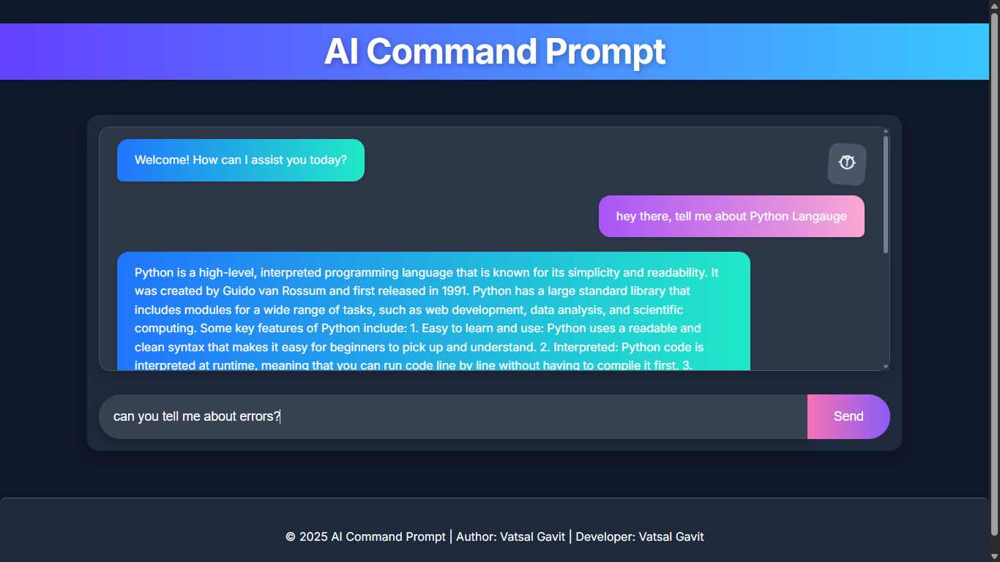
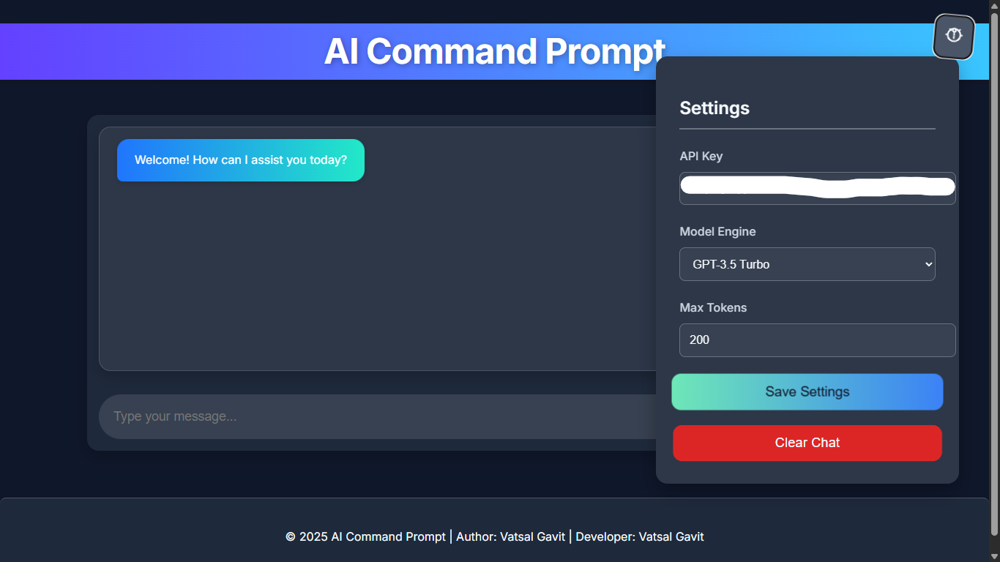

# 🤖 **AI Command Prompt**

<p align="center">
  <!-- Main Project Info -->
  <a href="LICENSE">
    
  </a>
  <a href="http://mmtpro.42web.io/VATSAL%20AI%20RROJECT/AI%20COMMAND%20PROMPT.html">
    
  </a>
  <a href="https://github.com/NONSTOPPEBLE/AI-COMMAND-PROMPT">
    
  </a>
  <a href="https://github.com/NONSTOPPEBLE/AI-COMMAND-PROMPT">
    
  </a>
</p>

<p align="center">
  <!-- GitHub Insights -->
  <a href="https://github.com/NONSTOPPEBLE/AI-COMMAND-PROMPT/stargazers">
    
  </a>
  <a href="https://github.com/NONSTOPPEBLE/AI-COMMAND-PROMPT/network/members">
    
  </a>
  <a href="https://github.com/NONSTOPPEBLE/AI-COMMAND-PROMPT/issues">
    
  </a>
  <a href="https://github.com/NONSTOPPEBLE/AI-COMMAND-PROMPT/commits">
    
  </a>
</p>

<p align="center">
  <!-- Build and Contribution -->
  <a href="https://github.com/NONSTOPPEBLE/AI-COMMAND-PROMPT/actions">
    
  </a>
  <a href="https://github.com/NONSTOPPEBLE/AI-COMMAND-PROMPT/graphs/contributors">
    
  </a>
  <a href="https://github.com/NONSTOPPEBLE/AI-COMMAND-PROMPT/pulls">
    
  </a>
  <a href="https://github.com/NONSTOPPEBLE/AI-COMMAND-PROMPT/discussions">
    
  </a>
</p>

**AI Command Prompt** is an AI-powered chatbot developed using OpenAI's GPT models. It supports 22 Indian languages and provides an intuitive interface for interacting with the AI. Users can edit, delete, and customize settings for a personalized chat experience.

This project is created by **Vatsal Gavit**, an 11th-grade student from Dang, Gujarat, India. 

> 🚧 **Note**: This project is **under development**. Some features may still be in progress, and bugs may be present. Contributions and feedback are welcome!

> 📱 **Fully responsive**: Works seamlessly across **all devices** (Desktop, Tablet, and Mobile). Access it through any modern web browser!

---

## 🌟 **Features**

- 🧠 **AI-powered** with OpenAI's GPT models (`gpt-3.5-turbo`, `gpt-4`, `text-davinci-003`)
- 🌐 Supports **22 Indian languages** for both input and output
- ✍️ **Edit** and 🗑️ **delete** messages in the chat interface
- ⚙️ **Customizable settings**:
  - API Key integration
  - Choose model engine (GPT-3.5, GPT-4, or Davinci)
  - Adjust token limits for fine-grained control
- 🎨 **Responsive UI** with **Lucide Icons** and **Google Fonts**
- 📱 **Mobile-friendly**, **Tablet-ready**, and **Desktop optimized** for a seamless user experience on all devices.
- 💬 **Interactive Chat**: Edit, delete, and personalize your conversations with ease.
  
---

## 🛠️ **Tech Stack**

- **Frontend**: HTML5, CSS3, JavaScript
- **AI Model**: OpenAI GPT API
- **Icons**: Lucide Icons
- **Fonts**: Google Fonts (Inter)
- **Data Storage**: LocalStorage (for settings persistence)
- **Responsive Design**: Built with modern CSS techniques to ensure it works on all screen sizes.

---

## 🔐 **API Key Usage**

To interact with the AI, you need an **OpenAI API key**.

### **Demo Mode**

- The **live demo** uses a **public API key** (rate-limited).
- You can try it on the demo website, but please be aware of the limitations.

### **Use Your Own API Key**

1. **Go to [OpenAI API Keys](https://platform.openai.com/account/api-keys)** and log in (or create an account).
2. Click **Create new secret key**, then copy the generated key.
3. **Paste the key** into the **Settings panel** in the app to start interacting with the AI.

---

## 📁 **Project Structure**

Here’s the folder structure for the project:

```
ai-command-prompt/
├── index.html                # Splash Screen HTML file
├── AI COMMAND PROMPT.html    # Main HTML file
├── assets/                   # Folder for assets like images and icons
│   └── screenshots/          # Optional folder for screenshots
├── css/                      # Folder for all CSS files
│   ├── style.css             # Custom styles for the UI
│   └── splash-screen.css     # Styling for the splash screen
├── js/                       # Folder for all JavaScript files
│   ├── vatsal.js             # JavaScript for chat logic and settings
│   └── screenscriptbyvatsal.js  # Additional JS logic (if any)
├── README.md                 # Documentation file
└── LICENSE                   # Project license (MIT or other)
```

---

## 🚀 **Getting Started**

### 1. **Clone the Repository**

Clone the project to your local machine:

```bash
git clone https://github.com/your-username/ai-command-prompt.git
cd ai-command-prompt
```

### 2. **Run Locally**

To launch the app locally, simply open `index.html` in any modern browser:

```bash
start index.html
```

### 3. **Add Your OpenAI API Key**

1. Click the ⚙️ **Settings** button in the app.
2. Enter your **OpenAI API key**.
3. Choose your preferred **GPT model** (GPT-3.5, GPT-4, or Davinci).
4. Adjust the **max tokens** based on your preference.

---

## 🌍 **Live Demo**

Try the live demo at:  
🔗 **[AI Command Prompt Live Demo](http://mmtpro.42web.io/VATSAL%20AI%20RROJECT/)**

> ⚠️ The demo uses a **public API key** with limited access and may be rate-limited.

---

## 🖼️ **Screenshots**

| Chat Interface | Settings Panel |
|----------------|----------------|
|  |  |

---

## 💻 **How It Works**

1. **Chat Interface**: 
    - Users type in the input field, and the AI responds based on the selected GPT model.
    - Users can **edit** and **delete** messages for better interaction.

2. **Settings Panel**: 
    - Input your API key, select a model, and adjust token limits.
    - Settings are stored in **localStorage**, ensuring persistence across sessions.

3. **API Integration**: 
    - The app communicates with the **OpenAI API** to fetch responses based on user input.

---

## 🔮 **Roadmap**

- 🎤 **Voice input and output** (using Whisper or Vosk)
- 🔊 **Text-to-speech** for better interaction
- 🌑 **Dark mode** support
- 📶 **Offline mode** with FAQ-like responses
- 📱 **PWA (Progressive Web App)** support for mobile devices

---

## 🙏 **Credits**

- [OpenAI API](https://platform.openai.com/)
- [Lucide Icons](https://lucide.dev/)
- [Google Fonts - Inter](https://fonts.google.com/specimen/Inter)

---

## 👤 **Author**

### **Vatsal Gavit**
📍 *Dang, Gujarat, India*  
📧 *Email*: [vatsalgame28@gmail.com](mailto:vatsalgame28@gmail.com)  

### Connect with Me:
<p align="left">
  <a href="https://www.linkedin.com/in/vatsal-gavit-787608274" target="_blank">
    
  </a>
  <a href="https://github.com/NONSTOPPEBLE" target="_blank">
    
  </a>
  <a href="https://www.instagram.com/vatsal_.x.09_/" target="_blank">
    
  </a>
  <a href="mailto:vatsalgame28@gmail.com">
    
  </a>
</p>

## 📄 **License**

This project is licensed under the [MIT License](LICENSE).  
Feel free to use, modify, and share with attribution.

---

> ⭐ **Like this project?** Please give it a ⭐ on GitHub and share it with friends!

---

## ⚠️ **Disclaimer**

- 🚧 **Under Development**: This project is still in the development phase. Some features may not be fully functional, and there may be bugs or incomplete implementations. We are constantly working on improving it.
- 💬 **Contributions**: Contributions are welcome! Feel free to fork the repository and submit pull requests.
```
